# Dockerized Data Tool

A CSV summary CLI with optional schema contracts, shipped as a hardened, multi-platform container image.

[](https://github.com/juanberrio0399/dockerized-data-tool/actions/workflows/tests.yml)
[](https://github.com/juanberrio0399/dockerized-data-tool/actions/workflows/publish.yml)


## What it is and the problem it solves

`app.py` reads a CSV and prints its shape, columns and numeric `describe()` table. On its own that is ten lines of pandas.

What makes it useful is everything around it. Bad input never produces a traceback: it produces one `Error: …` line on stderr and a distinct exit code a script can branch on. A `--schema` contract catches the silent breakages that actually hurt a pipeline — a renamed column, text landing in a numeric column, required values gone empty — before the summary runs and before anything downstream consumes the file.

And it ships as a container, not as a `pip install`. The published image runs as an unprivileged UID, carries an SBOM and SLSA provenance, and only reaches the registry after a vulnerability scan passes on the exact bits that get pushed. That chain, not the pandas call, is the point of the repo.

## How it works

```mermaid
flowchart TD
    subgraph cli["Running the tool"]
        C1["app.py FILE"] --> C2{"path readable"}
        C2 -->|"missing, a directory,<br/>no permission"| E2["exit 2"]
        C2 -->|"yes"| C3{"pandas can parse it"}
        C3 -->|"empty or malformed"| E1["exit 1"]
        C3 -->|"yes"| C4{"which flag"}
        C4 -->|"--infer-schema FILE"| C5["write the YAML contract:<br/>columns, dtypes, nullability"] --> E0a["exit 0"]
        C4 -->|"--schema FILE"| C6{"pandera validate,<br/>lazy"}
        C6 -->|"fails"| E3["one line per problem,<br/>exit 3"]
        C6 -->|"passes"| C7
        C4 -->|"neither"| C7["print rows, columns<br/>and numeric describe"]
        C7 --> C8{"--insights"}
        C8 -->|"no"| E0b["exit 0, no network call"]
        C8 -->|"yes"| C9["send aggregate stats only<br/>to Gemini, 30s, one retry"]
        C9 -->|"key missing or API fails"| E4["exit 4,<br/>summary already printed"]
        C9 -->|"ok"| E0c["print explanation, exit 0"]
    end

    subgraph ci["Release, per platform, on native runners"]
        P1["build on ubuntu-24.04<br/>and ubuntu-24.04-arm"] --> P2["Trivy: CRITICAL and HIGH<br/>with a fix available"]
        P2 -->|"any finding"| P3["job fails, nothing published"]
        P2 -->|"clean"| P4["SPDX SBOM + smoke test:<br/>runs, and UID is not 0"]
        P4 --> P5["push the scanned image,<br/>assert pushed digest = scanned image"]
        P5 --> P6["attest SLSA provenance<br/>and SBOM per digest"]
        P6 --> P7["imagetools create: manifest list<br/>from the two scanned digests"]
        P7 --> P8["assert the index holds exactly<br/>those two digests, one per platform"]
        P8 --> P9["attest provenance of the index"]
    end
```



Nothing is rebuilt between the scan and the push, and the workflow fails unless the digest it pulled back equals the image Trivy looked at. What you pull is byte for byte what was scanned and smoke tested.

Both platforms build on native runners — GitHub's free `ubuntu-24.04-arm` for arm64 — so there is no QEMU emulation and the arm64 smoke test runs on real arm64 hardware.

### Exit codes

| Situation | Exit code |
|---|---|
| Summary printed, or schema written; includes a header-only file and a file with no numeric columns | `0` |
| The file is empty, or is not parseable as CSV (malformed, binary); also an unreadable `--schema` YAML | `1` |
| The path does not exist, is a directory, cannot be read; also a missing `--schema` file or an unwritable `--infer-schema` target | `2` |
| The CSV does not match the contract passed with `--schema` | `3` |
| `--insights` could not run — no `GEMINI_API_KEY`, or the API failed. The summary was already printed | `4` |

### Schema contracts

```bash
python app.py sample.csv --infer-schema schema.yaml   # write the contract from a known-good file
python app.py new_export.csv --schema schema.yaml     # validate every later file against it
```

The inferred contract fixes the columns, their dtypes and whether empty values are allowed — and nothing else. pandera's own `infer_schema` also turns the reference file's min/max into range checks, which would reject almost any valid new file; those are stripped in `write_schema`. Business rules are added by editing the YAML, for example `checks: {greater_than_or_equal_to: 0}` under a column.

A file that breaks the contract exits `3` with one readable line per problem, not a pandera traceback:

```text
Error: missing column 'revenue'
Error: column 'units': expected int64 values, found 'twelve' (line 3)
```

`describe_failures` groups the failure table by column and problem, shows at most 3 examples and suppresses the knock-on errors: a cell that failed a type check is not reported a second time as a failed range check.

### AI insights (opt-in)

`--insights` asks Google Gemini to read the statistics the tool just printed and explain them in plain language. Without the flag the tool makes no network call at all.

```bash
GEMINI_API_KEY=... python app.py sample.csv --insights
GEMINI_API_KEY=... python app.py sample.csv --insights --insights-anonymize   # hide column names too

docker run --rm -e GEMINI_API_KEY -v "$PWD:/data" data-tool python app.py /data/your.csv --insights
```

| Sent to Google | Never sent |
|---|---|
| Row and column counts | Any cell of any data row |
| Column names, unless `--insights-anonymize` | The file itself, or its path |
| Dtypes and the empty-value count per column | Text columns' most frequent values |
| The numeric `describe()` table | The API key in the URL or body — it travels in a header |

Text columns are reported by dtype and null count only. pandas' `describe()` would put their most frequent **raw value** in the `top` row, and that is real data. The payload is capped at 6,000 characters so a very wide file cannot become an unbounded upload.

The key is read from the environment only: never stored in the repo, never baked into the image (`-e GEMINI_API_KEY` forwards the one already in your shell), and never printed, not even inside an error message. A free key comes from <https://aistudio.google.com/apikey>.

## Repo structure

| Path | What lives there |
|---|---|
| `app.py` | The whole tool: CSV reading, summary, pandera contracts, the Gemini call and the CLI |
| `sample.csv` | Five rows of sample data, baked into the image as the default argument |
| `requirements.txt` | Runtime dependencies (pandas, pandera, pyyaml, requests) |
| `requirements-dev.txt` | The above plus pytest and a pinned Ruff |
| `pyproject.toml` | Ruff configuration only — the tool runs as `python app.py`, it is not an installable package |
| `Dockerfile` | Two-stage build: dependencies into a venv, then a runtime image with security updates and a non-root user |
| `.dockerignore` | Keeps history, tests and local files out of the build context |
| `tests/test_app.py` | CLI behaviour: exit codes, stderr, argument validation |
| `tests/test_schema.py` | Contract inference and the failure-message formatting |
| `tests/test_insights.py` | The Gemini path with the HTTP call mocked |
| `.github/workflows/tests.yml` | Ruff, pytest, image build, Trivy, non-root and error-handling checks |
| `.github/workflows/publish.yml` | The release pipeline in the diagram above |
| `.github/workflows/codeql.yml` | SAST over the Python |

## How to run it

Pull the published image — no clone, no build:

```bash
docker pull ghcr.io/juanberrio0399/dockerized-data-tool:latest
docker run --rm ghcr.io/juanberrio0399/dockerized-data-tool:latest          # built-in sample.csv
docker run --rm -v "$PWD:/data" ghcr.io/juanberrio0399/dockerized-data-tool:latest \
  python app.py /data/your.csv
```

| Tag | What it is |
|---|---|
| `latest`, `1`, `1.2`, `1.2.3` | Stable releases, from Git tags `vX.Y.Z` |
| `edge` | The latest commit on `main`; may change at any time |
| `build-linux-amd64`, `build-linux-arm64` | Internal staging tags the release workflow needs because `docker push` cannot push an untagged manifest. Not for use |

Pin a full version or a digest in scripts. The container runs as UID `10001`, so a mounted folder has to be readable by that user.

```bash
docker buildx imagetools inspect ghcr.io/juanberrio0399/dockerized-data-tool:latest   # both platforms
docker pull --platform linux/arm64 ghcr.io/juanberrio0399/dockerized-data-tool:latest # force one
gh attestation verify --owner juanberrio0399 \
  oci://ghcr.io/juanberrio0399/dockerized-data-tool:latest                            # provenance
```

Build it yourself:

```bash
docker build -t data-tool .
docker run --rm data-tool
docker run --rm -v "$PWD:/data" data-tool python app.py /data/your.csv
```

Or run it without Docker:

```bash
pip install -r requirements.txt
python app.py sample.csv
```

Development, the same commands CI runs:

```bash
pip install -r requirements-dev.txt
pytest -q                               # 41 tests; the Gemini call is always mocked
ruff check . && ruff format --check .
```

Environment variables, by name only:

| Name | Required | Effect if absent |
|---|---|---|
| `GEMINI_API_KEY` | only for `--insights` | `--insights` exits `4` with a message; the summary is unaffected. Every other flag needs no key |

No registry credentials exist anywhere: `publish.yml` authenticates to GHCR with the workflow's own `GITHUB_TOKEN`.

## Decisions and limits

**A container instead of a PyPI package.** A wheel pins Python libraries and nothing else — not the interpreter, not the OS libraries pandas links against. The image pins all three, so the tool that runs on a teammate's laptop is the same one that runs in a CI job.

**Two-stage build, non-root, fixed UID.** Dependencies are installed into `/opt/venv` in a build stage and only the finished venv is copied forward, so no pip cache or build leftovers reach the runtime layer. `apt-get upgrade` runs in the runtime stage because the `python:3.12-slim` base lags Debian security fixes — Trivy found fixable CRITICAL/HIGH CVEs in `perl-base`, `gzip`, `pcre2` and `sqlite` on an un-upgraded base. The app files are owned by root and only readable by `appuser`, so the process cannot rewrite its own code. UID `10001` is numeric and fixed so Kubernetes `runAsNonRoot` accepts it.

**Trivy gates on `ignore-unfixed`.** Failing on unpatched base-image CVEs would make the check permanently red and therefore ignored. Failing only on CRITICAL/HIGH findings that already have a fix keeps every red build actionable.

**No cross-run build cache.** Every build re-runs `apt-get upgrade` so a release always carries the latest security fixes. A cache would risk serving a stale upgrade layer, and both platforms build natively in a couple of minutes, so it would buy little.

**Gemini sends aggregates, never rows.** The alternative — sending a sample of the data — gives a far better explanation and makes the tool unusable on anything private. The cap on what leaves the machine is enforced in `stats_payload`, not in the prompt.

**Pandera contracts are structural by default.** A contract that also encoded the reference file's value ranges would fail on the next month's data and teach everyone to pass `--schema` never again.

What it deliberately does not do:

- **No output files.** The summary goes to stdout; there is no `--output`. `--infer-schema` is the only thing that writes.
- **No plots, no profiling report.** Just `describe()`.
- **CSV only.** No Parquet, no Excel, no JSON.
- **Whole-file reads.** `pd.read_csv` loads the file into memory; there is no chunked or streaming mode, so a file larger than RAM will fail.
- **No config file.** Everything is a flag or an environment variable.
- **The image has no shell entrypoint tricks.** `CMD` runs `python app.py sample.csv`; anything else is passed as a full command.

## Operation

| What runs on its own | When | Where the result lands |
|---|---|---|
| `tests.yml` — Ruff, pytest, image build, Trivy, non-root and exit-code checks | every push to `main`, every PR, Mondays 12:00 UTC | Actions checks |
| `publish.yml` — build and scan both platforms | every PR (never pushed), every push to `main`, every `v*.*.*` tag | Actions checks; a job summary with each digest |
| `publish.yml` — publish | push to `main` → `:edge`; tag `vX.Y.Z` → `:X.Y.Z`, `:X.Y`, `:X` and `:latest` | GHCR package, plus attestations |
| `codeql.yml` — SAST, `security-extended` | every push to `main`, every PR, Mondays 06:00 UTC | Security → Code scanning |
| Dependabot — Actions, pip and Docker, grouped | weekly, Tuesdays | a PR labelled `dependencies` |

The weekly cron on `tests.yml` exists because new CVEs appear in the base image even when no commit does; a red scheduled run means the base image needs a rebuild, not that the code broke.

To cut a release: tag `vX.Y.Z` on `main` and push the tag. To rehearse the push path without releasing, run `publish.yml` manually with a `test_tag` input (for example `citest`) and delete that package version afterwards.

When something fails:

- **Trivy fails the job.** A fixable CRITICAL/HIGH CVE appeared in the base image. Re-running usually fixes it because the build re-runs `apt-get upgrade`; if not, the `python:3.12-slim` base needs to move.
- **"Verify the pushed image is the scanned image" fails.** The registry returned something other than what was built. Do not re-tag around it; re-run the job.
- **The manifest-list verification fails.** The index picked up an entry that was not one of the two scanned digests. The staging tags may have been moved by a concurrent run; the `concurrency` group should prevent this, so investigate before republishing.
- **`gh attestation verify` fails for a tag.** Provenance is attested against digests. Resolve the tag first with `docker buildx imagetools inspect` and verify the digest.

## Current state and next steps

Working: the CLI and its exit codes, schema inference and validation with readable errors, the opt-in Gemini path with its privacy cap, the hardened image, and a release pipeline that publishes only scanned bits with SBOM and provenance on both platforms. 41 tests, none of which touches the network.

Half-done:

- No published `schema.yaml` example. The contract feature is documented but a user has to generate one to see the shape.
- `GEMINI_MODEL` is a constant in `app.py`, verified against Google's docs on 2026-09-15. When that model retires, the tool fails at runtime with an HTTP error and exit `4` — there is no version check and no test that would catch it early.
- The image is published but not versioned in the repo: there is no CHANGELOG, so `:1.2.3` means whatever the tag said.

Worth doing, from the repo's open radar issues:

- [#1 — Polars, uv and DuckDB](https://github.com/juanberrio0399/dockerized-data-tool/issues/1): pandas is the heaviest thing in the image and the reason it cannot read a file larger than memory.
- [#34 — local insights with Ollama](https://github.com/juanberrio0399/dockerized-data-tool/issues/34): would remove the only network call and the only API key, at the cost of image size.
- [#13 — structured data contracts and observability](https://github.com/juanberrio0399/dockerized-data-tool/issues/13): the natural extension of `--schema`, currently marked discarded.
- [#21 — automatic EDA with ydata-profiling](https://github.com/juanberrio0399/dockerized-data-tool/issues/21): worth weighing against the "no report files" decision above.

---

Built by Juan Berrio — Cloud & Data Engineer. Portfolio: [juanberrio0399.github.io](https://juanberrio0399.github.io)
